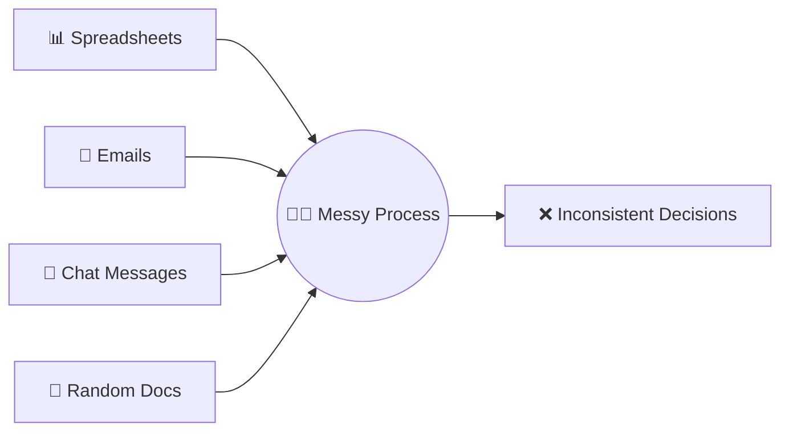
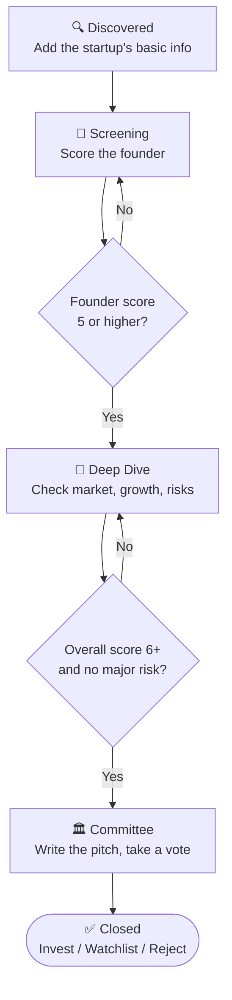
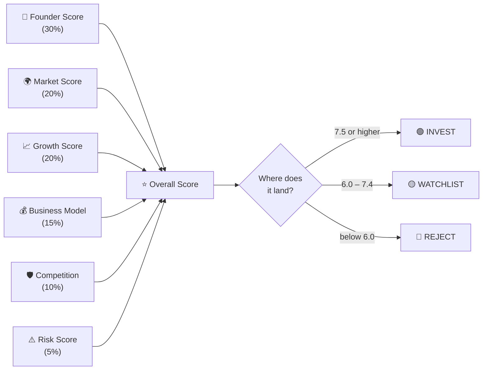
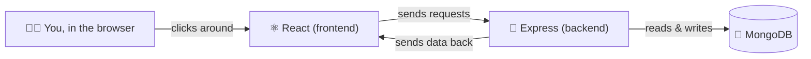

<div align="center">

# 📈 Investly

**A tool that helps investment teams decide which startups to fund — using real scores, not guesswork.**


</div>

<br/>

## 🤔 What's the problem?

Right now, investment teams keep startup info everywhere — spreadsheets, emails, chats, docs. Nothing is in one place, and nobody scores things the same way.



<br/>

## 💡 What does Investly do instead?

One pipeline. A startup moves forward **only if its score is good enough**. If it's not, it gets stuck — and the app tells you exactly why.



**In plain words:** you can't reach a final decision by skipping steps. The numbers have to actually earn it.

<br/>

## 🧮 How scoring works



**Two extra safety rules:**
- A startup never starts with a fake "average" score — it starts at **zero** until someone actually evaluates it.
- If founder risk is rated "High," the system blocks an INVEST recommendation no matter how good the rest of the score looks. One bad red flag can outweigh a good average — just like a real investor would think.

<br/>

## ⚙️ How the app is built



Nothing is faked — every number on screen comes from a real database call.

<br/>

## ✨ What you can actually do in the app

- ➕ **Add a startup** — quick 3-step form, or upload a spreadsheet to add many at once
- 👤 **Score the founder** — rate 5 qualities + log meeting notes
- 📊 **Analyze the business** — market size, growth, competition, risks
- 🚦 **Watch it move through the pipeline** — see exactly which stage every startup is in
- 🏛️ **Make the final call** — Invest, Watchlist, or Reject, with a comment explaining why
- 🔲 **Compare startups side-by-side** — pick up to 3 and see how they stack up with an All-Rounder pick
- 📈 **Check the dashboard** — live counts, top opportunities, recent activity
- 🤖 **Ask the AI Diligence Assistant** — icon button in the sidebar with live portfolio Q&A and comparisons
- 📥 **Export pipeline to CSV** — 1-click button on Startups list to download your dataset into a spreadsheet

## 🚀 Local Setup & Running Guide

### 📋 Prerequisites
- **Node.js**: v18.0.0 or higher
- **npm**: v9.0.0 or higher

### ⚡ 3-Step Quickstart

```bash
# 1. Clone the repository
git clone https://github.com/Mokshilxhah/Investly.git
cd Investly

# 2. Install all dependencies (root, server, client)
npm run install:all

# 3. Seed database with 8 mature venture startups
npm run seed

# 4. Start full-stack development servers concurrently
npm run dev
```

* **Frontend Client**: Open [http://localhost:5173](http://localhost:5173) in your browser.
* **Backend API**: Running at [http://localhost:5000](http://localhost:5000) (Health Check: [http://localhost:5000/api/health](http://localhost:5000/api/health)).
* **Database**: Automatically connects to local MongoDB (`mongodb://127.0.0.1:27017/startup_intelligence`) or seamlessly falls back to an embedded in-memory database with zero configuration.

<br/>

## 📂 Where things live

```
Investly/
├── client/     → everything you see (React)
├── server/     → the logic and database (Express + MongoDB)
└── docs/       → notes on how the scoring works
```

<br/>

## ✅ What's done

| Piece | Status |
|---|:---:|
| Add / edit / delete startups | ✅ |
| Score the founder | ✅ |
| Analyze the business + risks | ✅ |
| Pipeline stages that actually gate progress | ✅ |
| Live dashboard | ✅ |
| Compare startups | ✅ |
| AI Diligence Assistant | ✅ |
| Export pipeline to CSV | ✅ |

<br/>

<div align="center">

Thank You ❤️

</div>
