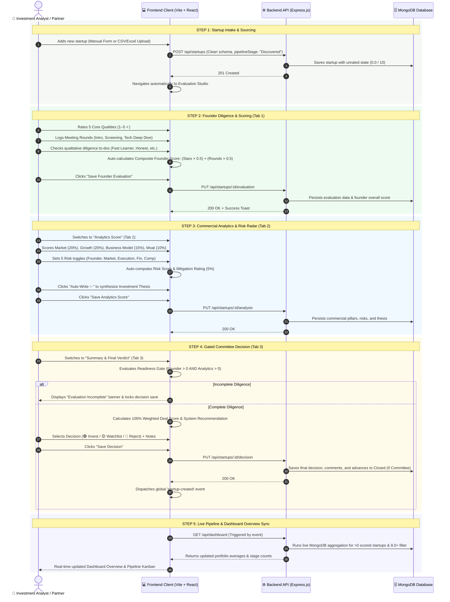

# Investment Platform Solution & User Flow Architecture

This document provides a comprehensive, visual blueprint of how the **Investment Evaluation Platform** solves venture capital diligence challenges through progressive stage-gating, dual-track scoring engines, and live event-driven pipeline synchronization.

---

## 🗺️ 1. End-to-End Solution Architecture Flowchart

```mermaid
flowchart TD
    %% INTAKE PHASE
    subgraph Intake["1. Startup Intake & Sourcing"]
        A1[Single Startup Wizard] --> B1[Normalize & Validate Data]
        A2[Excel / CSV Bulk Upload] -->|Smart Fuzzy Matcher| B1
        B1 --> C1[Auto-register as 'Discovered' <br/> Clean State: 0.0/10 Score]
    end

    %% EVALUATION PHASE
    subgraph EvaluationStudio["2. Evaluation Studio (Progressive Diligence)"]
        C1 --> Tab1["Tab 1: Founder Evaluation"]
        
        subgraph FounderEngine["Founder Dual-Track Engine (30% Weight)"]
            F1[5 Core Qualities ⭐<br/>Domain, Execution, Vision, Tech, Lead] --> F_Star[Normalized Star Score /10]
            F2[Meeting Rounds Tracker 📝<br/>Intro, Tech Deep, Partner Pitch] --> F_Round[Average Round Score /10]
            F3[Diligence Checklist ✓<br/>Fast Learner, Honest, Focus, Team] --> F_Check[Verified Traits Count]
            
            F_Star & F_Round --> F_Comp["Composite Founder Score<br/>(Star × 0.50) + (Rounds × 0.50)"]
        end
        
        Tab1 --> FounderEngine
        FounderEngine --> Tab2["Tab 2: Commercial Analytics"]
        
        subgraph AnalyticsEngine["Commercial & Risk Engine (70% Weight)"]
            A_Pil[4 Commercial Pillars<br/>Market TAM 20% | Growth 20%<br/>Business Model 15% | Moat 10%]
            A_Risk[5-Category Risk Radar<br/>Founder, Market, Execution, Fin, Comp] --> R_Calc["Auto-Risk Score = High×2 + Med×1 + Low×0.2<br/>Mitigation Score (5%) = 10 - Risk Score"]
            A_Thesis[Auto-Write Investment Thesis ✨]
        end
        
        Tab2 --> AnalyticsEngine
        AnalyticsEngine --> Tab3["Tab 3: Summary & Final Verdict Cockpit"]
    end

    %% GATE & DECISION PHASE
    subgraph DecisionCockpit["3. Committee Decision & Stage Gate"]
        Tab3 --> GateCheck{"Diligence Complete?<br/>Founder > 0 & Analytics > 0"}
        
        GateCheck -- "❌ Incomplete" --> BlockMsg["⚠️ Show 'Evaluation Incomplete' Banner<br/>Lock Decision Buttons<br/>Provide Direct Navigation Links"]
        BlockMsg --> Tab1
        
        GateCheck -- "✅ Ready" --> OverallScore["Calculate 100% Weighted Deal Score<br/>Founder(30%) + Market(20%) + Growth(20%)<br/>+ Model(15%) + Moat(10%) + Risk(5%)"]
        
        OverallScore --> Recommendation["System Recommendation Badge<br/>INVEST (≥7.5) | WATCHLIST (6.0-7.4) | REJECT (<6.0)"]
        Recommendation --> CommitteeVote["1-Click Committee Action<br/>🟢 INVEST | 🟡 WATCHLIST | 🔴 REJECT<br/>+ Partner Notes"]
    end

    %% SYNCHRONIZATION & COMPARISON PHASE
    subgraph LiveSync["4. Real-Time Pipeline & Dashboard Sync"]
        CommitteeVote -->|Dispatches 'startup-created' Event| D_Sync[Instant Live State Refresh]
        
        D_Sync --> Dash1["Dashboard Overview<br/>• Live Scored Portfolio Averages<br/>• Top Scored Startups (8.0+ Filter)<br/>• Pipeline Counts (In Pipeline, Invested, etc.)"]
        D_Sync --> Pipe1["Stage Advancement Engine<br/>canAdvance() Validation Checks<br/>Dwell Time & Bottleneck Detection"]
        D_Sync --> Comp1["Deal Comparison Matrix (/compare)<br/>1-to-3 Startup Side-by-Side Diligence"]
    end

    %% STYLING
    classDef intake fill:#f4f7f4,stroke:#64748b,stroke-width:1.5px,color:#0f172a;
    classDef eval fill:#eefbf0,stroke:#10b981,stroke-width:2px,color:#064e3b;
    classDef decision fill:#fffbeb,stroke:#f59e0b,stroke-width:2px,color:#78350f;
    classDef sync fill:#f0f9ff,stroke:#0284c7,stroke-width:2px,color:#0c4a6e;
    
    class Intake intake;
    class EvaluationStudio eval;
    class DecisionCockpit decision;
    class LiveSync sync;
```

---

## 🚶‍♂️ 2. Step-by-Step User Journey Flow



---

## ⚖️ 3. How We Solved the Problem Differently (Before vs. After)

| Venture Diligence Challenge | Traditional / Naive Approach ❌ | Our Built Solution ✅ |
|---|---|---|
| **1. Subjective Founder Scoring** | Analysts pick a single arbitrary number out of thin air without empirical justification. | **50%–50% Dual Engine**: Combines normalized 1–5 ⭐ quality traits ($50\%$) with logged multi-round partner meeting scores ($50\%$). |
| **2. Phantom Default Biases** | New startups pre-populate with default 5/10 scores, distorting portfolio analytics. | **Zero Default Bias**: Clean initial state (`0.0 / 10`). Averages only include startups with active diligence. |
| **3. Disconnected Meeting Notes** | Meeting notes live in separate Google Docs or emails, disconnected from deal scores. | **Integrated Meeting Tracker**: Logs meeting types, dates, notes, and individual ratings directly inside the startup profile. |
| **4. Risk Evaluation** | Subjective paragraphs that fail to impact the final mathematical deal score. | **Dynamic 5-Category Risk Radar**: High/Medium/Low toggles dynamically compute a quantitative risk score ($\max(0, 10 - \text{Risk}) \times 5\%$). |
| **5. Premature Committee Votes** | Decisions are recorded haphazardly before diligence is completed. | **Enforced Decision Gate**: Decision recording is strictly locked until both Founder and Analytics scores are submitted. |
| **6. Stale Dashboard Metrics** | Dashboard requires manual page reloads and shows stale, hardcoded stats. | **Event-Driven Live Sync**: Global event bus (`startup-created`) refreshes metrics, averages, and 8.0+ filters in real time. |
| **7. Startup Comparison Clutter** | Comparison matrices load with pre-filled random startups causing confusion. | **Clean Blank State**: Launches empty with 1-to-3 selector chips for focused side-by-side deal analysis. |

---

## 📊 4. Mathematical Formula Quick Reference

### 1. Founder Performance Score ($30\%$ Overall Weight)
$$\text{Star Score} = \left(\frac{\sum_{i=1}^5 \text{Star Rating}_i}{25}\right) \times 10$$

$$\text{Rounds Score} = \frac{\sum_{j=1}^N \text{Round Score}_j}{N}$$

$$\text{Composite Founder Score} = (\text{Star Score} \times 0.50) + (\text{Rounds Score} \times 0.50)$$

---

### 2. Risk Mitigation Score ($5\%$ Overall Weight)
$$\text{Raw Risk} = \min\Big(10,\; (\text{High Counts} \times 2.0) + (\text{Med Counts} \times 1.0) + (\text{Low Counts} \times 0.2)\Big)$$

$$\text{Risk Mitigation Score} = \max(0,\; 10 - \text{Raw Risk})$$

---

### 3. Overall Weighted Investment Deal Score ($100\%$)
$$\begin{aligned}
\text{Overall Deal Score} = &\; (\text{Founder Score} \times 0.30) \\
& + (\text{Market Score} \times 0.20) \\
& + (\text{Growth Score} \times 0.20) \\
& + (\text{Business Model Score} \times 0.15) \\
& + (\text{Competitive Moat Score} \times 0.10) \\
& + (\text{Risk Mitigation Score} \times 0.05)
\end{aligned}$$

---

### 4. Committee Recommendation Logic
$$\text{Recommendation} = \begin{cases} 
\text{INVEST 🟢} & \text{if } \text{Overall Score} \ge 7.5 \\ 
\text{WATCHLIST 🟡} & \text{if } 6.0 \le \text{Overall Score} < 7.5 \\ 
\text{REJECT 🔴} & \text{if } \text{Overall Score} < 6.0 
\end{cases}$$
